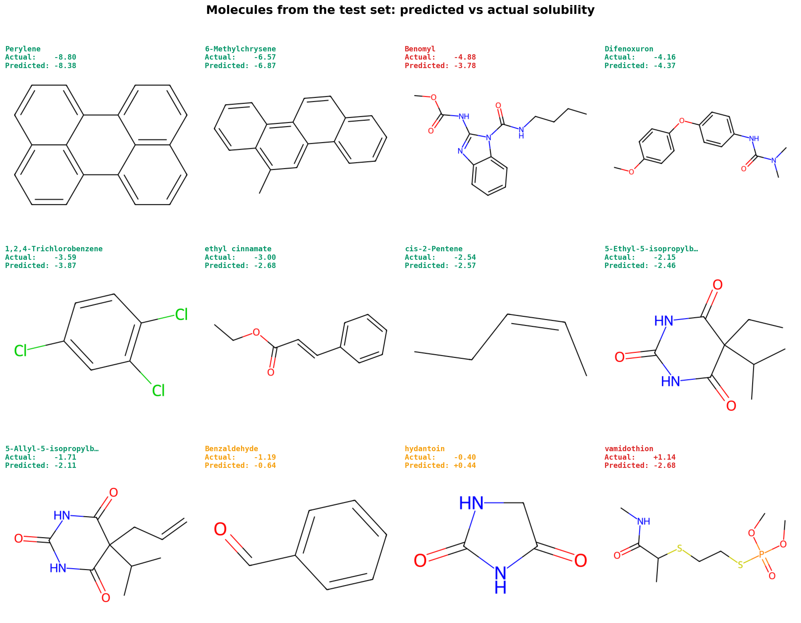
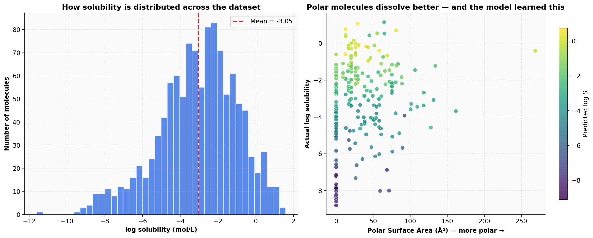
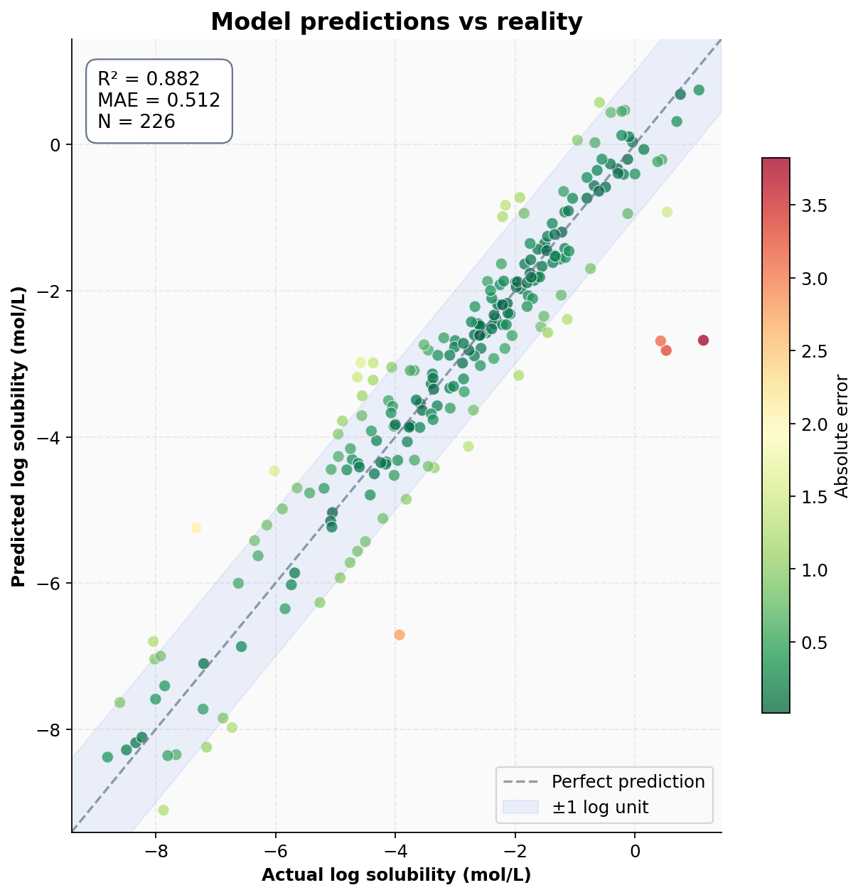
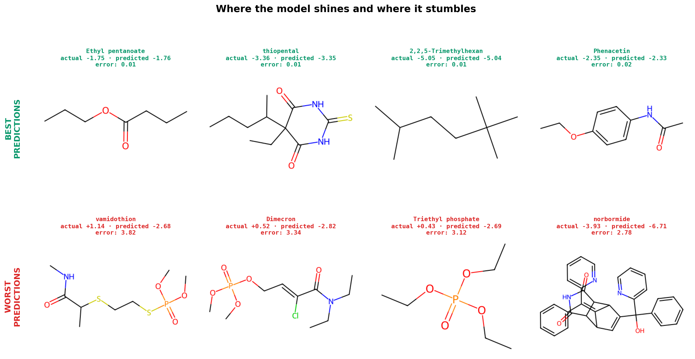
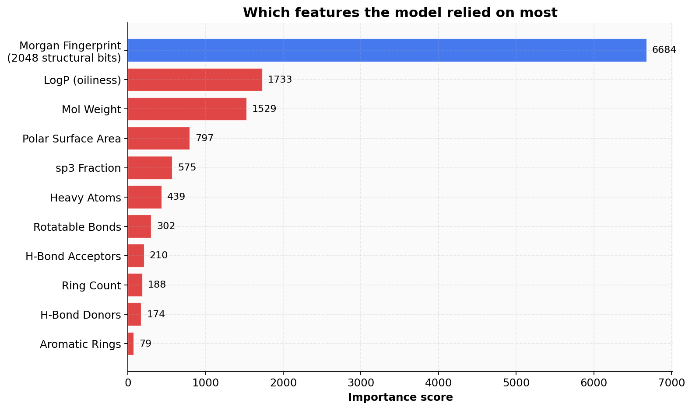

# Will it dissolve? — Predicting Molecular Solubility with Machine Learning

This project trains a model that takes a molecule's structure and predicts how well it dissolves in water. It learns the chemistry rule everyone gets taught in class — *like dissolves like* — purely from data.

The dataset is **ESOL (Delaney)**, a classic benchmark of 1,128 small organic molecules with experimentally measured aqueous solubility values.

---

## What's in this repo

- **delaney.csv** — the raw dataset (SMILES strings + measured log solubility)
- **solubility-predictor.ipynb** — full pipeline: loading, featurization, training, all visualizations
- **lgbm\_model.pkl** — the trained LightGBM model
- **results/** — all generated plots

---

## How it works

Each molecule comes as a SMILES string (a compact text encoding of structure — for example `CCO` means ethanol). To turn that into something a model can eat, every molecule is represented by:

- A **Morgan fingerprint** (2,048 binary bits describing local atomic neighborhoods — basically a structural barcode)
- 10 **chemistry descriptors** (molecular weight, LogP, polar surface area, hydrogen-bond donors and acceptors, rotatable bonds, aromatic rings, etc.)

These features feed into a **LightGBM regressor** trained to predict log solubility. Train/test split is 80/20 with early stopping on the validation set.

---

## Results

| Metric | Value |
|---|---|
| **R²** | **0.882** |
| RMSE | 0.747 log mol/L |
| MAE | 0.512 log mol/L |
| Test set size | 226 molecules |

Most predictions land within ±1 log unit of reality — which is roughly the same noise level you'd get measuring solubility experimentally twice.

---

## The good stuff (visuals)

### Molecules from the test set, predicted vs actual



Twelve molecules sampled across the full solubility range, drawn with their predicted and measured values. Green labels mean the model nailed it (error under 0.5 log units), orange means close, red means it missed.

### Did the model actually learn chemistry?



The right-hand plot is the proof: molecules with higher polar surface area (more polar groups) have higher solubility, AND the model's predictions (color) follow the same trend. This is *like dissolves like*, learned from data.

### Predictions vs reality



Most points hug the diagonal. The blue band marks ±1 log unit — the standard "good enough" threshold for solubility prediction.

### Best vs worst predictions



The worst errors are almost all organophosphate pesticides — they have unusual structural patterns underrepresented in the training data. Classic ML failure mode: the model doesn't know what it doesn't know.

### What features the model used



The Morgan fingerprint dominates (it carries the actual structural info), but among the hand-crafted features, **LogP** and **molecular weight** lead — exactly the properties chemists themselves use to eyeball solubility.

---

## Why solubility matters (the chemistry side)

Solubility decides whether a drug can reach your bloodstream after you swallow a pill, whether a pesticide washes away in rain, whether a paint dissolves in its solvent. Predicting it from structure alone — without ever running the experiment — saves chemists massive amounts of lab time. ESOL has been a standard benchmark for this since 2004, and an R² around 0.88 is solidly competitive with traditional methods.

---

## How to run

```bash
git clone https://github.com/Kreytorn/solubility-predictor.git
cd solubility-predictor
pip install rdkit lightgbm scikit-learn matplotlib pandas numpy
jupyter notebook solubility-predictor.ipynb
```

The notebook handles everything end-to-end. Total runtime: a couple of minutes on a normal laptop.

---

## Stack

`Python` · `RDKit` · `LightGBM` · `scikit-learn` · `matplotlib` · `pandas`
